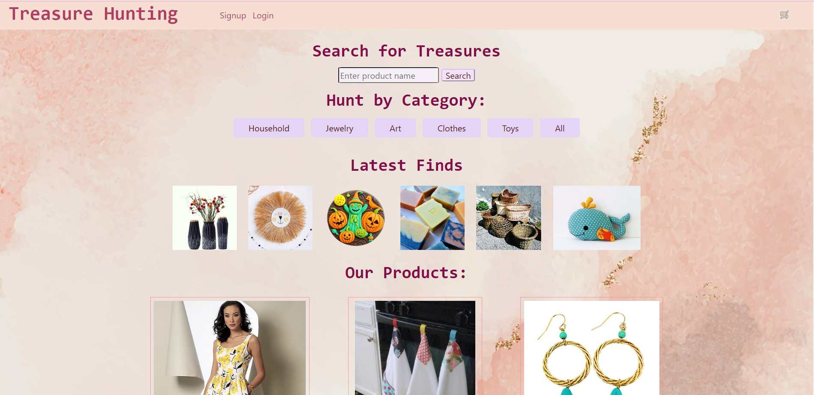

# Treasure-Hunting
## DESCRIPTION

A webpage where buying is as easy as one click away. This page will give the user easy access to the latest crafted product, with the ability to purchase. It also allows whoever creates an account with us, to sell their product, allowing them to grow their own business.

## TABLE OF CONTENTS

1. [Links](#links)
2. [Installation](#installation)
3. [Usage](#usage)
4. [Contributing](#contributing)

## LINKS

- Click [here](https://github.com/alexandrazykova/Treasure-hunting) for source code files on GitHub
- Click [here](https://fathomless-scrubland-54521-6c1ae888d125.herokuapp.com/) for LIVE application deployment

## INSTALLATION

1. Download the source from GitHub
2. run `npm i` to get all the packages.
3. create the seed `nom run seed`
4. run the program `npm run develop`
7. open a browser and navigate to `http://localhost:3000/` to experience the app.

## USAGE

1. Once inside the app, click any product image or name to go to the product.
2. In the product, add it to the cart or delete it from the cart.
3. If want to check out, create an account or sign in.
4. When logged in, more pages will appear.
5. If want to add a product, insert the name, description and image
6. View all favourite products saved in your account
7. To buy a product, simply checkout on the top right corner.
8. done!

## CONTRIBUTING
This work was made by our team:
- [Alexandra Zykova](https://github.com/alexandrazykova)
- [Sarah Naveed](https://github.com/SarahNk1-Maker)
- [Ariana Vinamagua](https://github.com/ari07-ari)
